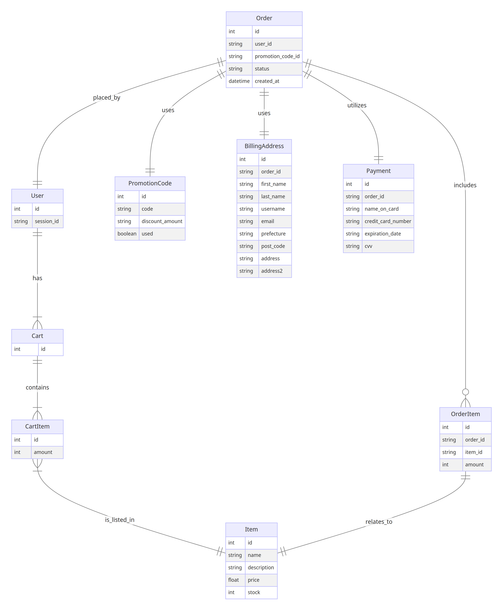

# README

### 前提

- dockerが必要です。

### setup

```
docker compose build
```

```
docker compose run --rm web bin/setup
```


```
docker compose run --rm web yarn install
```

## run

```
docker compose up
```

http://localhost:3000

### 備考(使用したもの)

## rubocop

auto correct

```
docker compose run --rm web bundle exec rubocop -A
```

## htmlbeautifier


```
docker compose run --rm web bin/htmlbeautifier
```

### ER図



